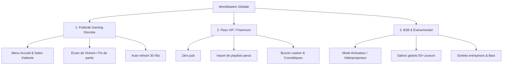

# 🚀 Stratégie de Monétisation & Business Plan - BlindTest

Ce document synthétise la feuille de route stratégique, technique et financière pour monétiser la plateforme de BlindTest sans dégrader l'expérience utilisateur.

---

## 1. Vision & Positionnement

### 1.1 Proposition de valeur
Un jeu web de BlindTest multijoueur **instantané (zéro installation, jouable sur navigateur mobile et desktop)**, combinant :
- **Un mode compétitif (Versus 1v1 avec ELO)** pour la rétention et les joueurs assidus.
- **Un mode festif (Salons privés, Mode Équipe Bleu vs Rouge, Saisie Libre ou Buzzer)** pour la viralité organique (un joueur invite son groupe d'amis).

### 1.2 Facteurs clés de succès
- **Boucle virale naturelle** : Chaque salon créé recrute 2 à 10 nouveaux joueurs via le lien d'invitation direct.
- **Accessibilité totale** : Fonctionne aussi bien sur smartphone que sur PC en temps réel.
- **Tolérance zéro à la frustration** : Pas d'interruption publicitaire pendant la phase de jeu actif.

---

## 2. Modèle de Monétisation Hybride (Mix Optimal)

---

## 3. Pilier 1 : Publicité Programmatique Ciblée (Régies Gaming)

### 3.1 La Règle d'Or : Menus Uniquement
- **Strictement interdit** : Aucune pub vidéo ou interstitielle bloquant le chrono, coupant la musique ou s'affichant entre les manches.
- **Emplacements validés** :
  1. **Sticky Footer Banner (728x90 sur PC / 320x50 sur mobile)** :
     - Visible sur la page d'accueil (`Home`), dans le salon d'attente (`CustomLobbyScreen`) et sur le profil (`ProfileScreen`).
     - **Automatiquement masqué** dès que `phase === 'PLAYING'` ou `phase === 'BUZZED'`.
  2. **Pavé latéral ou sous le podium (300x250)** :
     - Présent sur la modale finale de résultats (`MatchVictoryModal`). C'est le moment où les joueurs discutent du classement pendant 30 à 60 secondes.

### 3.2 Régies Recommandées & CPM Réels
| Régie | Seuil d'accès | Spécialité | CPM Moyen (Europe) |
| :--- | :--- | :--- | :--- |
| **NitroPay** | ~100k vues/mois | Jeux web multijoueurs (.io / .gg) | 1,20 € à 2,50 € (jusqu'à 4 € en fin d'année) |
| **Playwire / Venatus** | ~150k vues/mois | Gaming & Divertissement | 1,50 € à 3,00 € |
| **Google AdSense** | 0 vue (démarrage) | Généraliste (idéal pour débuter) | 0,60 € à 1,40 € |

> **Mécanisme d'Auto-Refresh** : Sur NitroPay, activer le rechargement automatique des bannières toutes les 35 secondes tant que l'onglet est actif. Cela multiplie par 2 à 3 le nombre d'impressions par session sans déranger le joueur.

### 3.3 Estimations Financières selon le Trafic
*Hypothèse : CPM net moyen de 1,50 €, environ 35% d'adblockers déduits, 2 à 3 parties par joueur (soit 8 à 12 impressions par session).*

| Joueurs Actifs / Jour (DAU) | Vues publicitaires / mois | Revenus estimés / mois |
| :--- | :--- | :--- |
| **500 joueurs / jour** | ~105 000 | **~150 € / mois** *(Autofinance déjà l'infrastructure)* |
| **2 000 joueurs / jour** | ~450 000 | **~650 € / mois** |
| **10 000 joueurs / jour** | ~2 400 000 | **~3 500 € / mois** |
| **30 000 joueurs / jour** | ~7 500 000 | **~11 000 € / mois** |

---

## 4. Pilier 2 : Pass VIP & Micro-Paiements (Abonnement 2,99 € / mois)

Pour les joueurs réguliers qui souhaitent une expérience premium et personnalisée :
1. **Suppression totale des bannières publicitaires**.
2. **Générateur de parties sur playlists personnalisées** :
   - Possibilité de coller le lien d'une playlist Spotify ou Deezer publique pour jouer sur ses propres musiques.
3. **Personnalisation audio du Buzzer** :
   - Choix du son de buzz parmi une bibliothèque fun (klaxon, cri rétro, son arcade, punchlines drôles).
4. **Statistiques avancées & Cosmétiques** :
   - Radar de force par décennie/genre (ex. 85% de réussite en Années 80, 40% en Rap).
   - Cadre de profil animé / doré, badges exclusifs dans les classements.

---

## 5. Pilier 3 : Offre B2B & Événementiel (Paiement One-Shot 19 € à 49 €)

Le secteur le plus rentable à court terme : afterworks, mariages, bars, team buildings.
* **Pack Soirée Pro (Achat direct par carte bancaire sans engagement)** :
  * Capacité débloquée jusqu'à 50 ou 100 participants simultanés dans un même salon.
  * **Mode Régie / Vidéoprojecteur** : L'écran principal est projeté sur grand écran/TV, tandis que les téléphones des participants servent uniquement de télécommandes buzzer interactives.
  * Personnalisation du salon aux couleurs de l'événement (logo de l'entreprise ou photo des mariés).

---

## 6. Cadre Juridique & Droits d'Auteur (Précautions Clés)

Pour pérenniser le business en toute légalité :
1. **Ne jamais commercialiser la musique** : L'utilisateur ne paie pas pour écouter de la musique, mais pour le **système de jeu, les scores, les salons privés et les outils d'animation**.
2. **Utilisation des flux officiels** : Continuer d'utiliser les extraits légaux de 30 secondes fournis par les APIs de streaming (Deezer / Spotify / iTunes).
3. **Conditions Générales d'Utilisation (CGU)** : Prévoir une mention stipulant que la plateforme est un jeu de culture musicale utilisant des extraits à visée d'identification courte.
4. **Évolution à terme** : Si le site dépasse 50 000 utilisateurs quotidiens, prévoir une prise de contact préventive ou un forfait de diffusion numérique adapté avec la SACEM/SDRM.

---

## 7. Nom de Domaine & Image de Marque (Branding)

### 7.1 Critères recommandés
- Court (2 à 3 syllabes), percutant, facile à épeler à l'oral en soirée.
- Extensions ciblées :
  - **`.gg`** : Recommandé n°1 (univers esport/gaming, trendy, moderne).
  - **`.io`** : Recommandé n°2 (standard mondial des jeux web multijoueurs).
  - **`.fr`** : Idéal si la cible reste 100% francophone au départ.

### 7.2 Suggestions de noms
- `BuzzTrack.gg` / `BuzzTrack.io`
- `BlindRush.io` / `BlindRush.gg`
- `SongDuel.gg` / `SongDuel.fr`
- `HitClash.io`
- `TrackMaster.gg`

---

## 8. Feuille de Route d'Exécution (Roadmap Étape par Étape)

### Étape 1 : Préparation & Lancement Propre (Semaines 1 - 2)
- [ ] Achat du nom de domaine définitif (ex. `buzztrack.gg`).
- [ ] Configuration DNS, certificat SSL HTTPS et SEO de base (balises OpenGraph pour prévisualisation WhatsApp/Discord).
- [ ] Ajout d'un bouton de partage rapide en 1 clic (WhatsApp, Messenger, copier le lien).

### Étape 2 : Acquisition Organique (Semaines 3 - 6)
- [ ] Création de clips courts TikTok / Shorts / Reels mettant en scène des parties entre amis avec le buzzer sonore.
- [ ] Lancement d'un serveur Discord communautaire avec un rendez-vous hebdomadaire (tournoi du vendredi soir).
- [ ] Intégration d'un système de don simple (*Buy Me a Coffee* ou *Stripe*) pour valider l'intérêt des premiers fans.

### Étape 3 : Déploiement Publicitaire Menu (Mois 2 - 3)
- [ ] Création du composant React `AdBannerSlot.tsx` compatible Google AdSense puis NitroPay.
- [ ] Placement de la bannière footer sur les pages d'accueil et salons d'attente.
- [ ] Placement du rectangle 300x250 sur l'écran de victoire.
- [ ] Soumission du site à NitroPay dès le cap des 100k pages vues/mois franchi.

### Étape 4 : Offre Pro & Abonnements VIP (Mois 4+)
- [ ] Implémentation de Stripe Customer Portal pour le Pass VIP à 2,99 €/mois.
- [ ] Création de la page "Organiser une soirée / Team Building" pour l'offre B2B.
